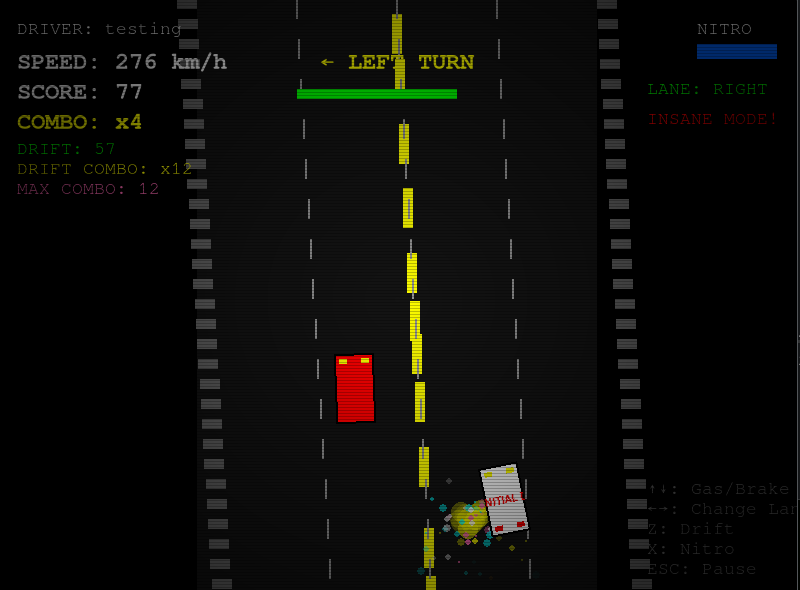
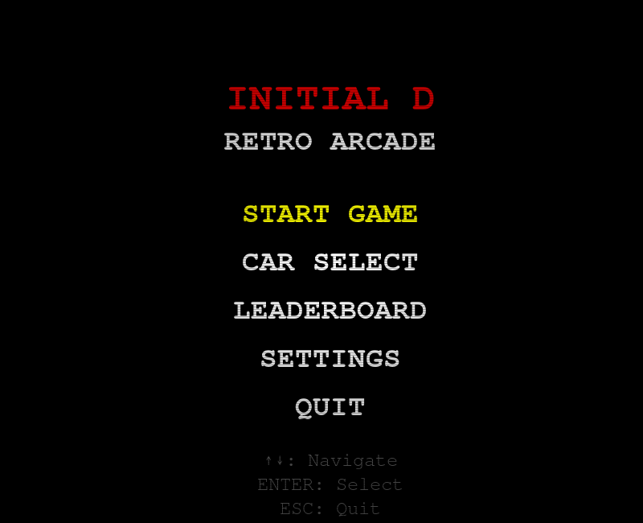
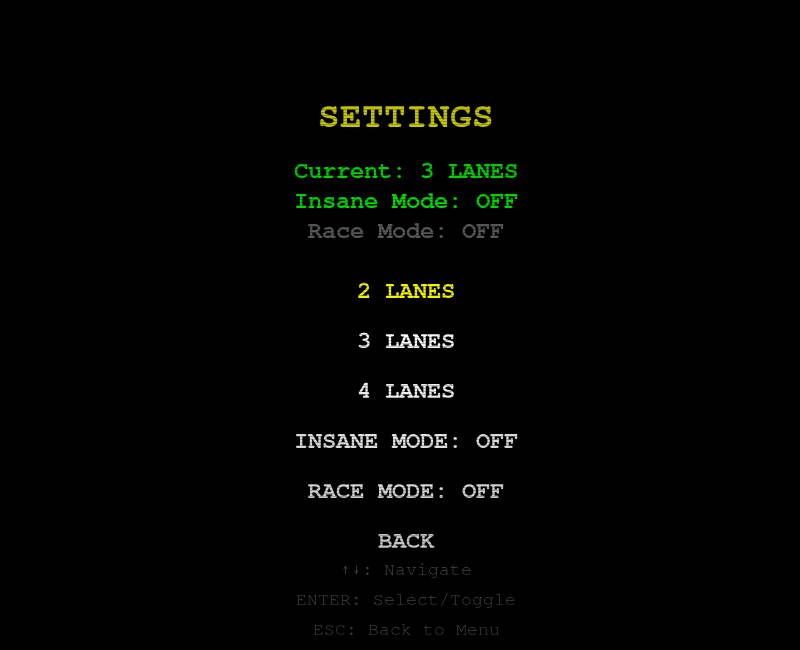
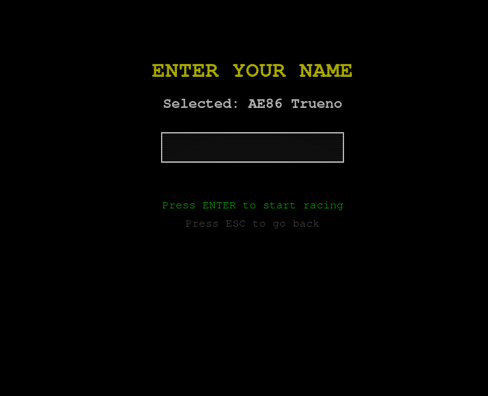
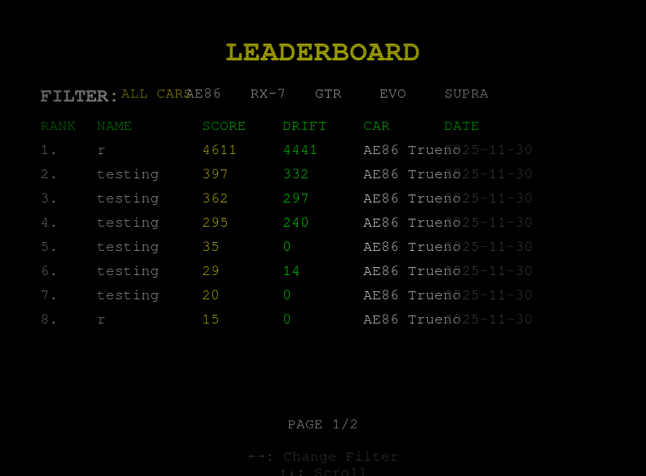

# InitialDrift
School project retro game repo, nothing special

------------------------------------------------------------ENGLISH-------------------------------------------------------------------------------------------------
# Initial Drift Retro Arcade

**Cars**
- **AE86 Trueno** - Balanced handling with excellent drift
- **Mazda RX-7** - Great acceleration and cornering
- **Nissan GTR** - High top speed
- **Lancer Evo** - All-around performance
- **Toyota Supra** - Maximum speed and power

**Game Modes**
- **Endless Mode** - Survive as long as possible while dodging traffic
- **Race Mode** - Compete against AI on challenging race tracks

**Advanced Drift System**
- Combo-based drift scoring
- Visual drift effects and particle systems
- Nitro boost from successful drifts
- Turn-based drift bonuses

**Customization**
- Adjustable difficulty (2, 3, or 4 lanes)
- Insane Mode for increased challenge
- CRT retro visual effects
- Personal driver name

**Leaderboards**
- Global and car-specific rankings
- Track high scores and drift performance
- Persistent data storage

**Controls**
Action	Key
Accelerate	↑ UP ARROW
Brake	↓ DOWN ARROW
Change Lane	← → LEFT/RIGHT ARROW
Drift	Z
Nitro Boost	X
Pause	ESC
Menu Navigation	ENTER, ARROW KEYS
Gameplay Tips
Mastering Drift

    Drift in turns for maximum points

    Maintain drift combos for higher scores

    Use nitro strategically for overtaking

Car Selection

    AE86: Best for beginners, great handling

    Supra: High risk/reward with top speed

    RX-7: Balanced performance for all tracks

Race Strategy

    Watch for turn warnings

    Manage nitro usage carefully

    Overtake enemies to build combos

Screenshots
Main Menu

Settings

Car selection

Leaderboard

Architecture

    Object-oriented design with Pygame

    Modular class structure for easy expansion

    JSON-based leaderboard system

    Custom particle and visual effects

------------------------------------------------------------POLISH--------------------------------------------------------------------------------------------------
# Initial Drift Retro Arcade

**Samochody**
- **AE86 Trueno** - Zbalansowane właściwości, doskonały do driftu
- **Mazda RX-7** - Świetne przyspieszenie i pokonywanie zakrętów
- **Nissan GTR** - Wysoka prędkość maksymalna
- **Lancer Evo** - Wszechstronne osiągi
- **Toyota Supra** - Maksymalna prędkość i moc

**Tryby Gry**
- **Tryb Niekończący** - Przetrwaj jak najdłużej omijając ruch
- **Tryb Wyścigu** - Ścigaj się przeciwko SI na wymagających torach

**Zaawansowany System Driftu**
- Punktacja driftu oparta na combo
- Efekty wizualne driftu i system cząsteczek
- Doładowanie nitro z udanych driftów
- Premie za drift w zakrętach

**Dostosowanie**
- Regulowana trudność (2, 3 lub 4 pasy)
- Tryb Szaleństwa dla zwiększonego wyzwania
- Retro efekty CRT
- Personalizowana nazwa kierowcy

**Tabela Wyników**
- Globalne i samochodowe rankingi
- Śledzenie najwyższych wyników i osiągów driftu
- Trwałe przechowywanie danych

**Sterowanie**
Akcja	Klawisz
Przyspiesz	↑ STRZAŁKA W GÓRĘ
Hamuj	↓ STRZAŁKA W DÓŁ
Zmień pas	← → STRZAŁKI LEWO/PRAWO
Drift	Z
Doładowanie Nitro	X
Pauza	ESC
Nawigacja w menu	ENTER, STRZAŁKI
Porady Rozgrywki
Mistrzostwo Driftu

    Driftuj w zakrętach dla maksymalnych punktów

    Utrzymuj combo driftu dla wyższych wyników

    Używaj nitro strategicznie do wyprzedzania

Wybór Samochodu

    AE86: Najlepszy dla początkujących, świetna sterowność

    Supra: Wysokie ryzyko/nagroda z najwyższą prędkością

    RX-7: Zbalansowane osiągi na wszystkie tory

Strategia Wyścigu

    Obserwuj ostrzeżenia o zakrętach

    Zarządzaj ostrożnie użyciem nitro

    Wyprzedzaj przeciwników do budowania combo

Zrzuty Ekranu

Menu Główne

Ustawienia

Wybór Samochodu

Tabela Wyników

Architektura

    Projekt obiektowy z Pygame

    Modułowa struktura klas dla łatwej rozbudowy

    System tabeli wyników oparty na JSON

    Niestandardowe efekty cząsteczkowe i wizualne
